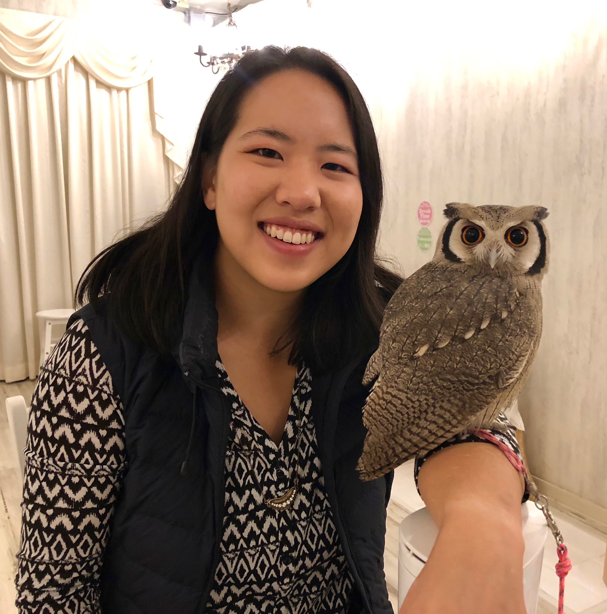
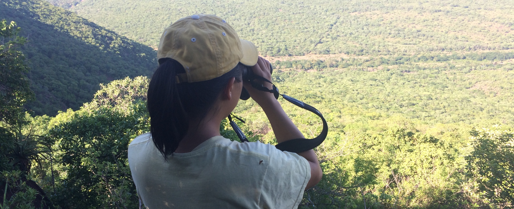

 

#**Alison Ke**
Email: ake@ucdavis.edu
 

{width=240px}{width=595px }

 

I am a 2nd year PhD student and NSF Research Fellow in the Graduate Group in Ecology at UC Davis. I am advised by Daniel Karp, and I am broadly interested in biodiversity conservation in agricultural landscapes. More specifically, my research aims to investigate ecological processes at the community level, conserve wildlife in developing nations, and develop novel statistical modeling techniques.
 
I grew up in Pennsylvania and went to UC Berkeley for my undergraduate degrees in forestry and statistics. Throughout my undergraduate career, I was lucky to be involved with several research projects, the most notable being a project combining data sources to map the distribution of the bearded pig (Sus barbatus), and an NSF-funded internship in Swaziland to study the effects of landscape heterogeneity on bird diversity. These experiences inspired me to pursue a graduate degree.
 
Besides studying animals, I am passionate about rock climbing, good food, and painting. 
