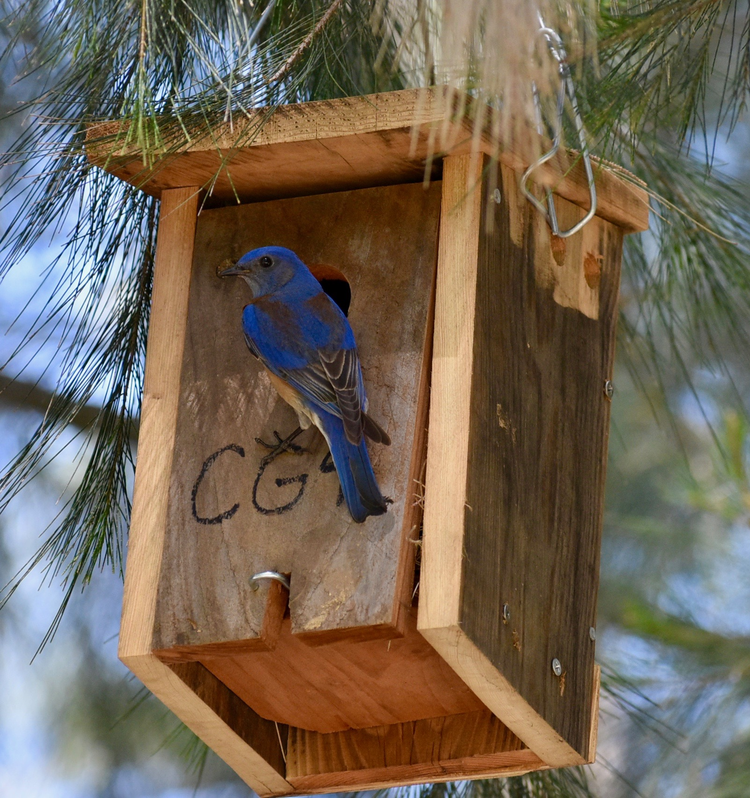
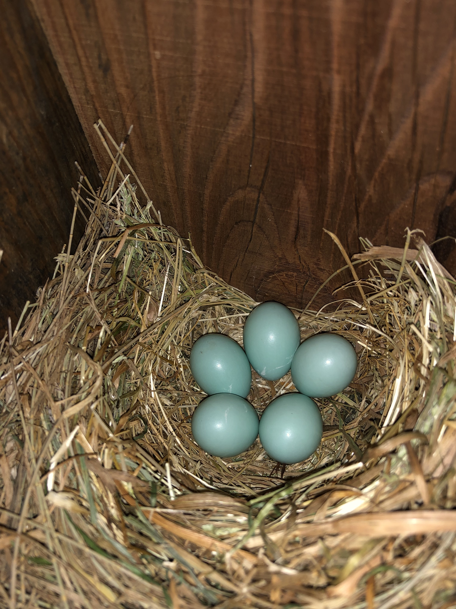
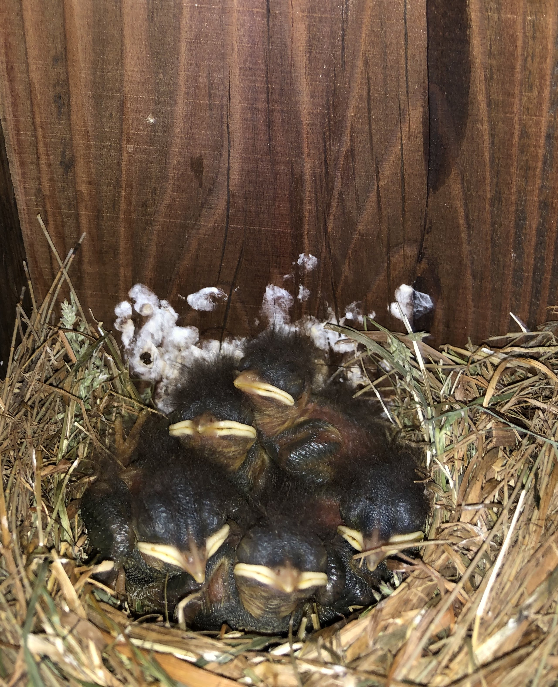
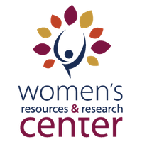

 

#**Service**
 

### Davis Nestbox Network
 

<figure>
 {width=30%}{width=24%}{width=26%} 
</figure>
 

To aid conservation close to home, I am the the Stewardship Co-Chair of the UC Davis Chapter of the Society of Conservation Biology (SCB). I am leading a project working with the City of Davis, the Wildlife Museum, and the local community to create a bluebird nest box network throughout parks in Davis. This local project reflects my motivation to use nest boxes as a conservation tool abroad, in Ecuador. Annually, I have around 10 undergraduate interns to help monitor nest boxes, and I write blog posts about this project at https://mwfbsongbirdnestbox.wordpress.com/. 

To learn more about SCB, click <a href="http://davisscb.wixsite.com/scbdavis">here</a>.

  
 

### WiSE Mentorship
<figure>
 
</figure>
 

To promote diversity in my field, I serve as a mentor for the Womxn in Science & Engineering (WiSE) program at UC Davis. The mentorship aims to provide a supportive, gender positive environment in which mentors help mentees achieve their academic and professional goals. To learn more about the Women's Resources and Research Center (WRRC), click <a href="https://wrrc.ucdavis.edu/">here</a>.

 

